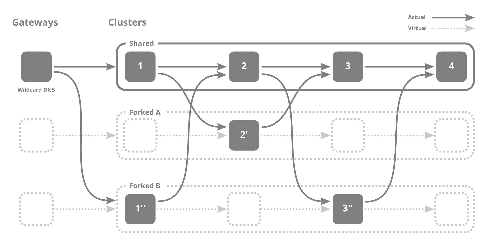

# kubefork

This document describes how kubefork works and the resources generated by kubefork.

- [kubefork](#kubefork)
  - [Testing issues in Microservices Architecture](#testing-issues-in-microservices-architecture)
  - [What is a virtual cluster?](#what-is-a-virtual-cluster)
  - [How kubefork realizes virtual clusters](#how-kubefork-realizes-virtual-clusters)
  - [How to do kubefork](#how-to-do-kubefork)
    - [NOTE](#note)
    - [Fork](#fork)
    - [ForkManager](#forkmanager)
      - [NOTE](#note-1)
    - [Mapping](#mapping)
    - [VirtualService](#virtualservice)
    - [DeploymentCopy](#deploymentcopy)
      - [VSConfig](#vsconfig)
  - [References](#references)

---

## Testing issues in Microservices Architecture

If you are a developer, it often happens that you want to test your changes. However, this is not easy when using a microservice architecture. Even if you change only one of the microservices, you have to consider the other microservices that communicate with it in order to test your application after the change. For example, mocking the communication with the other microservice. However, the developer must be aware of the other microservices on which it depends. This prevents developers from focusing on their own changes.

A possible solution to this problem is copying the entire microservice architecture cluster as a development cluster and replace only the changes in it. While this method certainly solves the previous problem, if multiple developers are developing different microservices at the same time, it will be difficult to determine which microservice change was responsible for the problem when it occurs. In other words, to help developers focus on their own changes without the influence of other developers, it is necessary to copy as many clusters as there are developers, but this is impractical in terms of computing resources and cost.

## What is a virtual cluster?

A solution to this problem is virtual clusters. A virtual cluster is **a pseudo-cluster that is realized by switching microservices only when you want to test them**. For example, suppose we have a microservice architecture with four microservices connected in series as shown below and developer A changes microservice 2 and developer B changes microservices 1 and 3. At this time, as the following diagram shows, requests to microservice 2 will be routed to 2' when tested by A, requests to microservice 1 will be routed to 1'' and requests to 3 will be routed to 3'' when tested by B.



As long as virtual clusters are used, developers are not affected by others' changes, so each developer can experience that have their own cluster, while copying is minimum. Thus, both A and B can focus their development efforts only on their own changes. The operation of creating such a virtual cluster (so that only your communication goes through the forked microservice) is called **kubefork**.

## How kubefork realizes virtual clusters

In realizing virtual clusters, it is important to determine which microservices are used for communication.

The HTTP header like `x-fork-identifier:identifier` is used to determine which microservice to assign the communication to.

Identifier is set to a specific header, and the destination microservice is determined by the identifier. The classification of communication by header is done by [Istio](https://github.com/istio/istio).

kubefork additionally provides

- One-click preview of changes
- Multiple people can preview the changes at the same time.

To achieve this, the identifier is included in a subdomain and reassembled into a header when connecting to the application. For example, accessing `identifier.example.com` will send an HTTP request to the service with the header `x-fork-identifier:identifier`. This way, developers can share the modified application by simply sharing the URL. The part of recombining subdomains into headers is done by the Mapping resource at [Emissary-ingress](https://www.getambassador.io/docs/emissary/).

## How to do kubefork

The following assumes knowledge of [Custom Resources and Custom Controllers](https://kubernetes.io/ja/docs/concepts/extend-kubernetes/api-extension/custom-resources/).

First, you need to create a [kubefork-controller](https://github.com/wantedly/kubefork-controller), [deployment-duplicator](https://github.com/wantedly/deployment-duplicator), [Istio](https://github.com/istio/istio) and [Emissary-ingress](https://www.getambassador.io/docs/emissary/) in the cluster where you want to do kubefork and apply the ForkManager resource. Once these are in place, kubefork can be performed simply by applying the Fork resource. kubefork-controller creates Mapping, DeploymentCopy, VirtualService and the copy of Service resources from the Fork and ForkManager resource. deployment-duplicator creates a copy of Deployment from DeploymentCopy.


The virtual cluster is realized by applying the Fork resource and generating Mapping, Service, Deployment and VirtualService resources. You can generate a manifest of the Fork resource by [kubeforkctl](https://github.com/wantedly/kubefork-controller/tree/main/kubeforkctl).

### NOTE

All communications between services must have a header such as `x-fork-identifier:identifier` in order to determine which service receives the communication to by the header. Each service must propagate the `x-fork-identifier:identifier` header to other services when it receives a communication with the header `x-fork-identifier:identifier`. However, **kubefork does not have header propagation capability** at this time. Therefore, **users must include the ability to propagate specific headers in their applications**.

### Fork

This is a resource that represents what to target and what kind of copy to make. The manifest specifies target Service/Deployment and ForkManager, the environment variables to be applied to the copied container, and the Docker image (ForkManager is required). The manifest can be generated using [kubeforkctl](https://github.com/wantedly/kubefork-controller/tree/main/kubeforkctl).

```yaml
apiVersion: fork.k8s.wantedly.com/v1beta1
kind: Fork
metadata:
  labels:
    fork.k8s.wantedly.com/identifier: some-identifier
  name: kubefork-some-identifier
  namespace: some-namespace
spec:
  # Effective time for Fork resource
  deadline: "2022-09-01T00:00:00Z"
  # DeploymentCopy information
  deployments:
    replicas: 1
    # Selector for which deployment to copy
    selector:
      matchExpressions:
      - key: some-key
        operator: Exists
    template:
      metadata:
        annotations:
          some-annotations: value1
        labels:
          app: some-identifier
          role: fork
      spec:
        containers:
        - env:
            # Environment variables to add to the copied container
          - name: FORK_IDENTIFIER
            value: some-identifier
          # Docker image to apply to copied containers
          image: some-name:some-tag
          name: container1
          resources: {}
        - env:
          - name: FORK_IDENTIFIER
            value: some-identifier
          image: some-name:some-tag
          name: container2
          resources: {}
  identifier: some-identifier
  # Specify ForkManager (<Namespace of ForkManager>:<Name of ForkManager>)
  manager: manager-namespace/manager-name
  # Selector for which service to copy
  services:
    selector:
      matchLabels:
        some-label: value2
status: {}
```

### ForkManager

Sets the headers used to assign communications, which host to send communications to and which service to send them to, and ambassadorID.

#### NOTE

- Currently, there is no tool like kubeforkctl to generate manifests for ForkManager resources, so users need to write a manifest of ForkManager resource.
- Once the ForkManager resource is created, access to the virtual cluster is done by URL only, so there is no need to remember what header key you used for assigning. See the kubefork documentation for details.

```yaml
apiVersion: fork.k8s.wantedly.com/v1beta1
kind: ForkManager
metadata:
  name: manager-name
  namespace: manager-namespace
spec:
  ambassadorID: fork-ambassador
  # Specify headers to be used for communication assign
  headerKey: x-fork-identifier
  upstreams:
    # Which host to send the incoming communication to which service
  - host: example1.com
    original: service1
  - host: example2.com
    original: service2:80
```

### Mapping

Mapping a subdomain to a header. **This resource is automatically generated by kubefork-controller.**

See [Emissary-ingress](https://www.getambassador.io/docs/emissary/) for a detailed specification of the Mapping resource.

```yaml
apiVersion: getambassador.io/v2
kind: Mapping
spec:
  add_request_headers:
    # add identifier to headers
    x-fork-identifier: some-identifier
  ambassador_id:
  - fork-ambassador
  # Send communication coming to some-identifier.example.com to port 80 of service-name.service-namespace
  host: some-identifier.example.com
  host_rewrite: service-name
  prefix: /
  rewrite: ""
  service: service-name.service-namespace:80
```

### VirtualService

It assigns communications by header to identify the service to be communicated with. **This resource is automatically created and updated by kubefork-controller.**

See [Istio](https://github.com/istio/istio) for a detailed specification of the VirtualService resource.

```yaml
apiVersion: networking.istio.io/v1beta1
kind: VirtualService
metadata:
  name: some-virtualservice
  namespace: some-namespace
spec:
  hosts:
  # The service to which the communication is sent
  - example
  http:
  - match:
    # header values and the corresponding services to which they are routed
      - headers:
          x-fork-identifier:
            exact: some-identifier1
    route:
      - destination:
          host: kubefork-some-identifier1-example
  - match:
      - headers:
          x-fork-identifier:
            exact: some-identifier2
    route:
      - destination:
          host: kubefork-some-identifier2-example
  - route:
    # Destination if none of the above apply
    - destination:
        host: example
```

### DeploymentCopy

This resource is used to generate a copy of Deployment. The manifest describes the differences from the Deployment resource that already exists. Then, deployment-duplicator will generate a new Deployment resource with the original Deployment resource and its differences. **This resource is automatically generated by kubefork-controller.**

See [deployment-duplicator](https://github.com/wantedly/deployment-duplicator) for a detailed specification of the DeploymentCopy resource.

```yaml
apiVersion: duplication.k8s.wantedly.com/v1beta1
kind: DeploymentCopy
metadata:
  name: some-deployment-kubefork-some-identifier
  namespace: some-namespace
spec:
  # Label for the copied Deployment
  customLabels:
    app: some-identifier
    fork.k8s.wantedly.com/identifier: some-identifier
    role: fork
  hostname: ""
  nameSuffix: kubefork-some-identifier
  replicas: 1
  # Container changes
  targetContainers:
    - env:
      - name: FORK_IDENTIFIER
        value: some-identifier
      image: some-name:some-tag
      name: container1
      resources: {}
    - env:
      - name: FORK_IDENTIFIER
        value: some-identifier
      image: some-name:some-tag
      name: container2
      resources: {}
  # Name of the Deployment resource to copy from
  targetDeploymentName: some-deployment
```

#### VSConfig

Resource for creating a VirtualService resource. This resource is created when you kubefork, and kubefork-controller creates a VirtualService resource corresponding to the target Service resource based on all existing VSConfig resources. **This resource is automatically generated by kubefork-controller.**

```yaml
apiVersion: fork.k8s.wantedly.com/v1beta1
kind: VSConfig
metadata:
  name: example-kubefork-some-identifier
  namespace: some-namespace
spec:
  # header information for assigning
  headerName: x-fork-identifier
  headerValue: some-identifier
  # which service to allocate incoming traffic to
  host: example
  service: example-kubefork-some-identifier
status: {}
```

## References

https://en-jp.wantedly.com/companies/wantedly/post_articles/313884 (Japanese)
