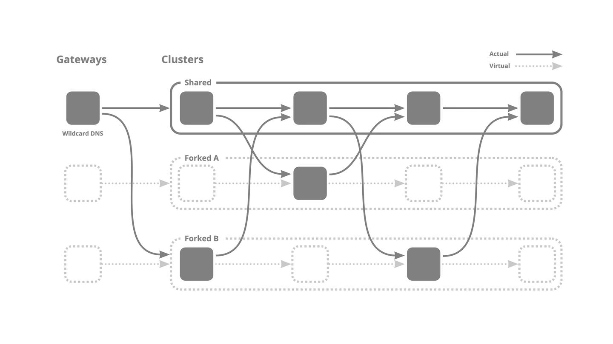
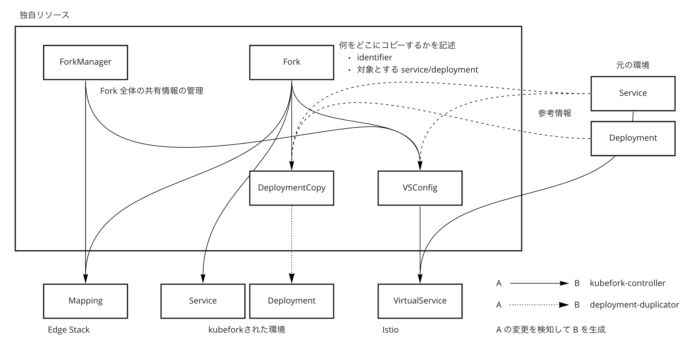

# kubefork

kubeforkは、あるクラスタを基に仮想クラスタを作る操作です。

kubeforkを使うことで、クラスタ全体をコピーすることなくコードの変更をテストできます。

## 概念

### マイクロサービスアーキテクチャにおけるテストの問題点

もしあなたが開発者であるなら、自分の変更をテストしたい場面が頻繁にあると思います。しかしながら、マイクロサービスアーキテクチャを使っている場合においては簡単ではありません。マイクロサービスのうち1つのみを変更した場合でも、変更後のアプリケーションをテストするためには、通信を行う別のマイクロサービスのことを考えなければなりません。たとえば、他のマイクロサービスとの通信をモックにするといった方法が考えられますが、開発者は依存する他のマイクロサービスを把握している必要があります。これでは開発者は自身の変更箇所に集中して開発を行うことができません。

この問題の解決方法として、マイクロサービスアーキテクチャのクラスタ全体を開発用クラスタとしてコピーし、開発用クラスタ中の変更部分のみを差し替えるという方法が考えられます。この方法では確かに先ほどの問題は解決できるのですが、同時に複数のマイクロサービスを開発している場合、問題の発生時にどちらのマイクロサービスの変更が原因なのかが分からなくなってしまいます。つまり、開発者が自分の変更箇所に集中できるかつ他の開発者の影響を受けないようにするためには、開発者の数だけクラスタをコピーする必要があるのですが、これは計算資源や費用的に現実的ではありません。

### 仮想クラスタとは

この問題を解決する方法が仮想クラスタです。仮想クラスタとは、**テストしたい時のみマイクロサービスを切り替えることで実現される、疑似的なクラスタ**です。たとえば以下のように4つのマイクロサービスが直列に繋がったマイクロサービスアーキテクチャがあるとします。ここで、開発者Aは2つ目のマイクロサービスを、開発者Bは1つ目と3つ目のマイクロサービスアーキテクチャを変更したとしましょう。この時、Aがテストする際には2つ目のマイクロサービスが変更したものに、Bがテストする際には1つ目と3つ目のマイクロサービスが変更後のものになります。



仮想クラスタを用いている限り、開発者は他者の変更の影響を受けることがないので、マイクロサービスのコピーは最小限に済ませつつ、開発者はそれぞれ自分だけのクラスタを持っているかのような体験ができます。そのため、AとBは共に自分の変更箇所のみに集中して開発を行うことができます。このような仮想クラスタを作る（自分の通信のみ変更後のマイクロサービスを通るようにする）操作を**kubefork**と呼びます。

## 概要

<!-- ここ矛盾? -->
前述の通り、kubeforkとは仮想クラスタを作る操作のことです。ここでは、kubeforkが仮想クラスタをどのように実現しているか、どのようにしてkubeforkを行うのかについて説明します。

### どのようにして仮想クラスタを実現しているか

仮想クラスタを実現するにあたり、以下の2つが重要になります。

- 通信している人をどのようにして判別するか
- 通信先のマイクロサービスをどのようにして振り分けるか

通信している人はHTTPヘッダによって判別されます。

`x-fork-identifier:identifier`

のように、特定のヘッダのfield valueにIdentifierを設定し、そのIdentifierによって通信先のマイクロサービスを決定しています。ヘッダによる実際に通信を振り分けは[Istio](https://github.com/istio/istio)によって行います。

<!-- なんかkubeforkが仮想クラスタの実装方法の1つみたいになってる -->
kubeforkではさらに

- ワンクリックで変更をプレビューできる
- 複数人がその変更を同時にプレビューできる

を達成するために、identifierをサブドメインに含ませ、アプリケーションへの接続時にヘッダへ組み替えています。たとえば、`identifier.example.com`へアクセスすると、`x-fork-identifier:identifier`というヘッダを持ったHTTPリクエストがサービスへと送信されます。このようにすることで、開発者はURLを共有するだけで変更後のアプリケーションを共有できます。サブドメインをヘッダに組み替える部分は[Edge Stack](https://github.com/datawire/edge-stack)のMappingリソースによって行なっています。

### どのようにしてkubeforkを行うか

以下、[カスタムリソース・カスタムコントローラー](https://kubernetes.io/ja/docs/concepts/extend-kubernetes/api-extension/custom-resources/)の知識を前提とします。

まず、kubeforkを行いたいクラスタに[kubefork-controller](https://github.com/wantedly/kubefork-controller)・[deployment-duplicator](https://github.com/wantedly/deployment-duplicator)・[Istio](https://github.com/istio/istio)・[Edge Stack](https://github.com/datawire/edge-stack)を導入し、ForkManagerリソースをapplyしておきます。一度これらを導入してしまえば、Forkリソースをapplyするだけでkubeforkを行うことができます。kubeforkを行う流れは以下のようになっています。kubefork-controllerはFork・ForkManagerリソースから、Mapping・DeploymentCopy・VirtualService・kubeforkされたServiceリソースを生成し、deployment-duplicatorはDeploymentCopyからkubeforkされたDeploymentリソースを生成します。



kubefork-controllerとdeployment-duplicatorが生成したMapping・Service・Deployment・VirtualServiceリソースによって、仮想クラスタが実現されます。

#### Fork

#### ForkManager

#### Mapping

```yaml
apiVersion: getambassador.io/v2
kind: Mapping
spec:
  add_request_headers:
    x-fork-identifier: identifier
  ambassador_id:
  - fork-ambassador
  host: identifier.example.com
  host_rewrite: example.com
```

#### VirtualService

#### DeploymentCopy

詳しくは https://github.com/wantedly/deployment-duplicator を参照してください。

#### VSConfig

## 参考文献

https://en-jp.wantedly.com/companies/wantedly/post_articles/313884