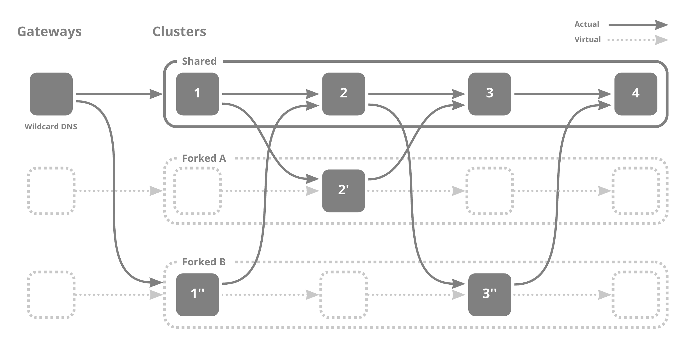

# kubefork

このドキュメントでは、kubeforkの仕組み及びkubeforkによって生成されるリソースについて説明しています。

- [kubefork](#kubefork)
  - [マイクロサービスアーキテクチャにおけるテストの問題点](#マイクロサービスアーキテクチャにおけるテストの問題点)
  - [仮想クラスタとは](#仮想クラスタとは)
  - [どのようにして仮想クラスタを実現しているか](#どのようにして仮想クラスタを実現しているか)
  - [どのようにしてkubeforkを行うか](#どのようにしてkubeforkを行うか)
    - [NOTE](#note)
    - [Fork](#fork)
    - [ForkManager](#forkmanager)
      - [NOTE](#note-1)
    - [Mapping](#mapping)
    - [VirtualService](#virtualservice)
    - [DeploymentCopy](#deploymentcopy)
    - [VSConfig](#vsconfig)
  - [参考文献](#参考文献)

---

## マイクロサービスアーキテクチャにおけるテストの問題点

もしあなたが開発者であるなら、自分の変更をテストしたい場面が頻繁にあると思います。しかしながら、マイクロサービスアーキテクチャを使っている場合においては簡単ではありません。マイクロサービスのうち1つのみを変更した場合でも、変更後のアプリケーションをテストするためには、通信を行う別のマイクロサービスのことを考えなければなりません。たとえば、他のマイクロサービスとの通信をモックにするといった方法が考えられますが、開発者は依存する他のマイクロサービスを把握している必要があります。これでは開発者は自身の変更箇所に集中して開発を行うことができません。

この問題の解決方法として、マイクロサービスアーキテクチャのクラスタ全体を開発用クラスタとしてコピーし、開発用クラスタ中の変更部分のみを差し替えるという方法が考えられます。この方法では確かに先ほどの問題は解決できるのですが、複数の開発者が同時に異なるマイクロサービスを開発している場合、問題の発生時にどちらのマイクロサービスの変更が原因なのかが分からなくなってしまいます。つまり、開発者が自分の変更箇所に集中できるかつ他の開発者の影響を受けないようにするためには、開発者の数だけクラスタをコピーする必要があるのですが、これは計算資源や費用的に現実的ではありません。

## 仮想クラスタとは

この問題を解決する方法が仮想クラスタです。仮想クラスタは、**テストしたい時のみマイクロサービスを切り替えることで実現される、疑似的なクラスタ**を表す独自用語です。たとえば以下のように4つのマイクロサービスが直列に繋がったマイクロサービスアーキテクチャがあるとします。ここで、開発者Aはマイクロサービス2を、開発者Bはマイクロサービス1と3を変更したとしましょう。この時、次の図が示すように、Aがテストする際にはマイクロサービス2へのリクエストは2'に、Bがテストする際にはマイクロサービス1へのリクエストは1''、3へのリクエストは3''へルーティングされます。



仮想クラスタを用いている限り、開発者は他者の変更の影響を受けることがないので、マイクロサービスのコピーは最小限に済ませつつ、開発者はそれぞれ自分だけのクラスタを持っているかのような体験ができます。そのため、AとBは共に自分の変更箇所のみに集中して開発を行うことができます。このような仮想クラスタを作る（自分の通信のみ変更後のマイクロサービスを通るようにする）操作を**kubefork**と呼びます。

## どのようにして仮想クラスタを実現しているか

仮想クラスタを実現するにあたり、通信をどのマイクロサービスに振り分けるかが重要になります。


どのマイクロサービスに振り分けるかは、HTTPヘッダによって判別されます。

`x-fork-identifier:identifier`

のように、特定のヘッダにIdentifierを設定し、そのIdentifierによって通信先のマイクロサービスを決定しています。ヘッダによる通信の振り分けは[Istio](https://github.com/istio/istio)によって行います。

kubeforkではさらに

- ワンクリックで変更をプレビューできる
- 複数人がその変更を同時にプレビューできる

を達成するために、identifierをサブドメインに含ませ、アプリケーションへの接続時にヘッダへ組み替えています。たとえば、`identifier.example.com`へアクセスすると、`x-fork-identifier:identifier`というヘッダを持ったHTTPリクエストがサービスへと送信されます。このようにすることで、開発者はURLを共有するだけで変更後のアプリケーションを共有できます。サブドメインをヘッダに組み替える部分は[Emissary-ingress](https://www.getambassador.io/docs/emissary/)のMappingリソースによって行なっています。

## どのようにしてkubeforkを行うか

以下、[カスタムリソース・カスタムコントローラー](https://kubernetes.io/ja/docs/concepts/extend-kubernetes/api-extension/custom-resources/)の知識を前提とします。

まず、kubeforkを行いたいクラスタに[kubefork-controller](https://github.com/wantedly/kubefork-controller)・[deployment-duplicator](https://github.com/wantedly/deployment-duplicator)・[Istio](https://github.com/istio/istio)・[Emissary-ingress](https://www.getambassador.io/docs/emissary/)を導入し、ForkManagerリソースをapplyしておきます。一度これらを導入してしまえば、Forkリソースをapplyするだけでkubeforkを行うことができます。kubeforkを行う流れは以下のようになっています。kubefork-controllerはFork・ForkManagerリソースから、Mapping・DeploymentCopy・VirtualServiceリソースとServiceのコピーを生成し、deployment-duplicatorはDeploymentCopyからDeploymentのコピーを生成します。


Forkリソースをapplyし、Mapping・Service・Deployment・VirtualServiceリソースが生成されることで、仮想クラスタが実現されます。Forkリソースのマニフェストは[kubeforkctl](https://github.com/wantedly/kubefork-controller/tree/main/kubeforkctl)を用いて生成できます。

### NOTE

ヘッダによって通信をどのサービスに割り振るかを判定するため、サービス間のすべての通信に`x-fork-identifier:identifier`といったヘッダが付いている必要があります。各サービスは、受け取った通信に`x-fork-identifier:identifier`というヘッダが付いていた場合、他のサービスへの通信にも`x-fork-identifier:identifier`ヘッダを伝播させなければなりませんが、現時点で**kubeforkにはヘッダ伝播機能はありません**。そのため、**ユーザは特定のヘッダを伝播させる機能をアプリケーションに搭載する必要があります**。

### Fork

何を対象にしてどのようなコピーを作るかを表すリソースです。マニフェストではコピーするService・DeploymentやForkManager、コピーしたコンテナに適用する環境変数やDockerイメージを指定します（ForkManagerは必須です）。マニフェストは[kubeforkctl](https://github.com/wantedly/kubefork-controller/tree/main/kubeforkctl)を用いて生成できます。

```yaml
apiVersion: fork.k8s.wantedly.com/v1beta1
kind: Fork
metadata:
  labels:
    fork.k8s.wantedly.com/identifier: some-identifier
  name: kubefork-some-identifier
  namespace: some-namespace
spec:
  # Forkリソースが有効な時間
  deadline: "2022-09-01T00:00:00Z"
  # DeploymentCopyの情報
  deployments:
    replicas: 1
    # どのdeploymentをコピーするかのセレクタ
    selector:
      matchExpressions:
      - key: some-key
        operator: Exists
    template:
      metadata:
        annotations:
          some-annotation: value1
        labels:
          app: some-identifier
          role: fork
      spec:
        containers:
        - env:
            # コピーされたコンテナへ追加する環境変数
          - name: FORK_IDENTIFIER
            value: some-identifier
          # コピーしたコンテナに適用するDockerイメージ
          image: some-name:some-tag
          name: container1
          resources: {}
        - env:
          - name: FORK_IDENTIFIER
            value: some-identifier
          image: some-name:some-tag
          name: container2
          resources: {}
  identifier: some-identifier
  # ForkManagerの指定（<ForkManagerのNamespace>:<ForkManagerの名前>）
  manager: manager-namespace/manager-name
  # どのServiceをコピーするかのセレクタ
  services:
    selector:
      matchLabels:
        some-label: value2
status: {}
```

### ForkManager

通信の振り分けに用いるヘッダやどのホストに来た通信をどのサービスに送るか、ambassadorIDを設定します。

#### NOTE

- 現時点では、kubeforkctlのようなマニフェストを生成できるツールがForkManagerリソースには存在しないため、ユーザはForkManagerリソースのマニフェストを自ら記述する必要があります。
- 一度ForkManagerリソースを作ってしまえば、仮想クラスタへのアクセスはURLのみで行われるため、振り分けのためのヘッダのキーを何にしたか覚えておく必要はありません。詳しくはkubeforkのドキュメントを参照してください。

```yaml
apiVersion: fork.k8s.wantedly.com/v1beta1
kind: ForkManager
metadata:
  name: manager-name
  namespace: manager-namespace
spec:
  ambassadorID: fork-ambassador
  # 通信の振り分けに用いるヘッダの指定
  headerKey: x-fork-identifier
  upstreams:
    # どのホストに来た通信をどのサービスに送るか
  - host: example1.com
    original: service1
  - host: example2.com
    original: service2:80
```

### Mapping

サブドメインをヘッダに付け替える操作を行います。**このリソースはkubefork-controllerによって自動生成されます。**

Mappingリソースの詳しい仕様については[Emissary-ingress](https://www.getambassador.io/docs/emissary/)を参照してください。

```yaml
apiVersion: getambassador.io/v2
kind: Mapping
spec:
  add_request_headers:
    # identifierをヘッダに追加
    x-fork-identifier: some-identifier
  ambassador_id:
  - fork-ambassador
  # some-identifier.example.comに来た通信をservice-name.service-namespaceの80番ポートに送信
  host: some-identifier.example.com
  host_rewrite: service-name
  prefix: /
  rewrite: ""
  service: service-name.service-namespace:80
```

### VirtualService

ヘッダによって通信をするサービスを振り分ける操作を行います。**このリソースはkubefork-controllerによって自動的に生成・更新されます。**

VirtualServiceリソースの詳しい仕様については[Istio](https://github.com/istio/istio)を参照してください。

```yaml
apiVersion: networking.istio.io/v1beta1
kind: VirtualService
metadata:
  name: some-virtualservice
  namespace: some-namespace
spec:
  hosts:
  # 通信が送られてくるサービス
  - example
  http:
  - match:
    # ヘッダの値とそれに対応する振り分け先のサービス
    - headers:
        x-fork-identifier:
          exact: some-identifier1
    route:
    - destination:
        host: kubefork-some-identifier1-example
  - match:
    - headers:
        x-fork-identifier:
          exact: some-identifier2
    route:
    - destination:
        host: kubefork-some-identifier2-example
  - route:
    # どれにも当てはまらない場合の振り分け先
    - destination:
        host: example
```

### DeploymentCopy

Deploymentのコピーを生成するためのリソースです。マニフェストにはすでに存在するDeploymentリソースとの差分を記述します。そうすることで、deployment-duplicatorが元のDeploymentリソースとその差分を持つ新たなDeploymentリソースを生成します。**このリソースはkubefork-controllerによって自動生成されます。**

DeploymentCopyリソースの詳しい仕様については[deployment-duplicator](https://github.com/wantedly/deployment-duplicator)を参照してください。

```yaml
apiVersion: duplication.k8s.wantedly.com/v1beta1
kind: DeploymentCopy
metadata:
  name: some-deployment-kubefork-some-identifier
  namespace: some-namespace
spec:
  # コピーしたDeploymentに付けるラベル
  customLabels:
    app: some-identifier
    fork.k8s.wantedly.com/identifier: some-identifier
    role: fork
  hostname: ""
  nameSuffix: kubefork-some-identifier
  replicas: 1
  # コンテナの変更点
  targetContainers:
    - env:
      - name: FORK_IDENTIFIER
        value: some-identifier
      image: some-name:some-tag
      name: container1
      resources: {}
    - env:
      - name: FORK_IDENTIFIER
        value: some-identifier
      image: some-name:some-tag
      name: container2
      resources: {}
  # コピー元となるDeploymentリソース名
  targetDeploymentName: some-deployment
```

### VSConfig

VirtualServiceリソースを生成するためのリソースです。このリソースは新たにkubeforkが行われるために生成されます。kubefork-controllerは存在するすべてのVSConfigリソースを基に、対象とするServiceリソースに対応するVirtualServiceリソースを生成します。**このリソースはkubefork-controllerによって自動生成されます。**

```yaml
apiVersion: fork.k8s.wantedly.com/v1beta1
kind: VSConfig
metadata:
  name: example-kubefork-some-identifier
  namespace: some-namespace
spec:
  # 振り分けるためのヘッダの情報
  headerName: x-fork-identifier
  headerValue: some-identifier
  # どのサービスに来た通信をどのサービスに振り分けるか
  host: example
  service: example-kubefork-some-identifier
status: {}
```

## 参考文献

https://en-jp.wantedly.com/companies/wantedly/post_articles/313884