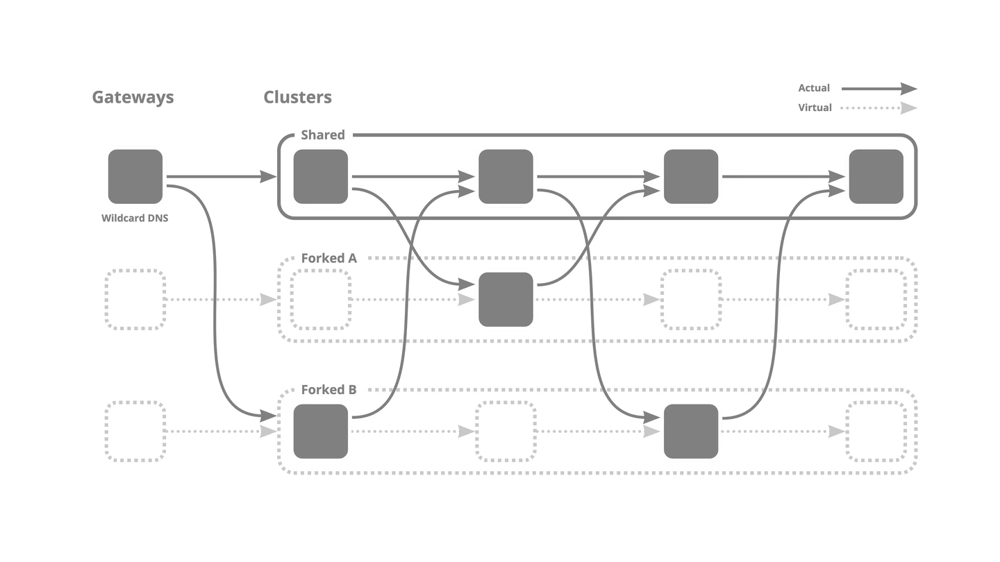

# kubefork
kubefork is the tool to create virtual cluster based on yours.

Using kubefork, you can preview the changes on microservice without copying a cluster entirely.

## Concept

If you use microservice architecture, 

kubefork offers an experience you have own cluster.

## Overview

## Resources

### Fork

### ForkManager

### DeploymentCopy
See https://github.com/wantedly/deployment-duplicator.

### VSConfig

### VirtualService